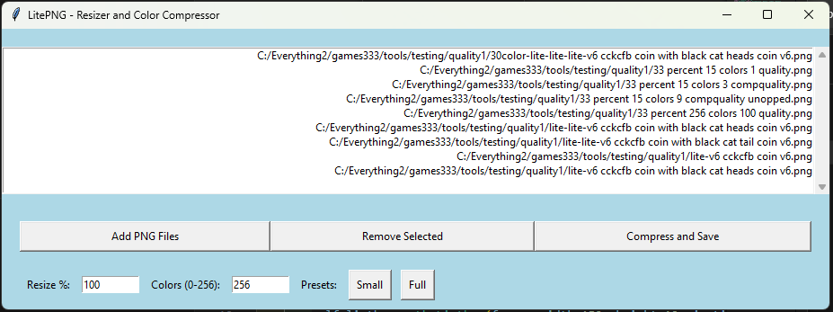

# 🎨🛠️ LitePNG -> 
## Color Compressor and Resizer

Welcome to the repository of the LitePNG Compressor and Resizer, a lightweight and powerful tool designed to make your PNG images lean and fast! Whether you're looking to save space or optimize images for web use, this tool has got you covered. 🚀

## Features ✨

- **Add PNG Files**: Load up your bulky PNGs and get them ready for a diet.
- **Remove Selected**: Changed your mind? No problem! Remove files from the list as you wish.
- **Compress and Save**: Squash those PNGs down to size with our compression algorithm.
- **Resize Options**: Scale your images down (or up) with preset or custom resize percentages.
- **Color Reduction**: Reduce the number of colors for further size reduction.
- **Presets**: Quick settings for common tasks:
  - **Small**: For when you need to go micro! 🐜
  - **Full**: Full size, but leaner. 🏋️‍♂️

## Screenshots and Pictures 📸

Here's how our app makes magic happen:

*Main Interface - Everything you need at your fingertips.*

*Small Preset - Great things come in small packages!*

52 KB @ 25% Resizing and 16 Colors.

*Full Preset - Full size, optimized to perfection!*

1340 KB @ 100% Resizing and 256 Colors.

## How to Use 🔍

1. **Start the Application**: Just run the app and let the intuitive interface guide you.
2. **Add Your PNG Files**: Use the 'Add PNG Files' button to load your images.
3. **Choose Your Settings**: Select a preset or set custom values for resizing and colors.
4. **Compress**: Hit the 'Compress and Save' button and choose where to save your optimized image.